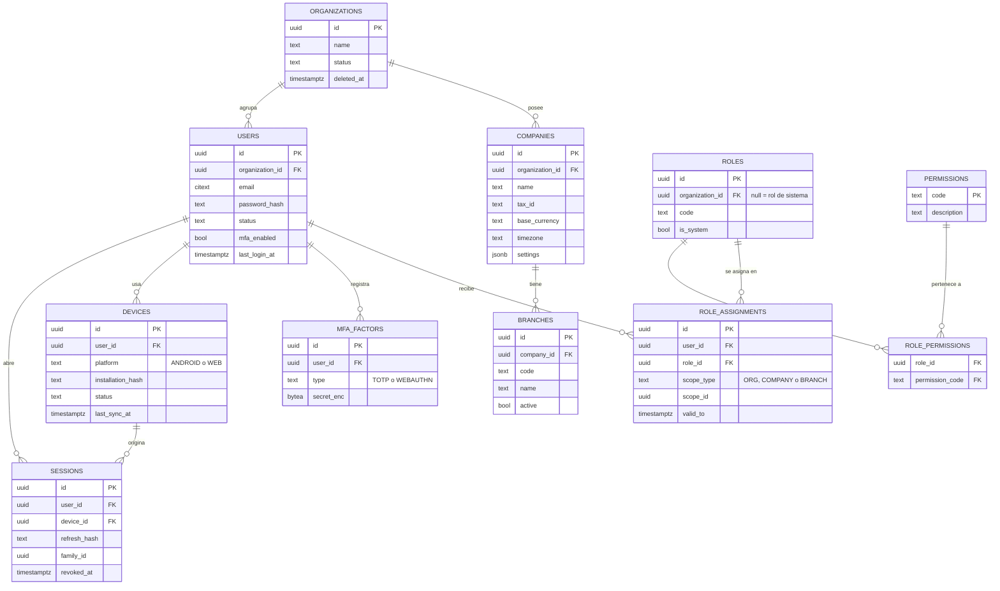
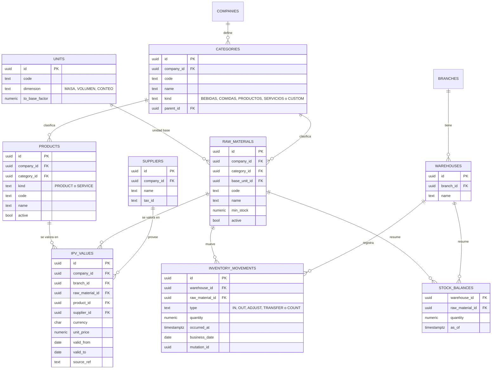
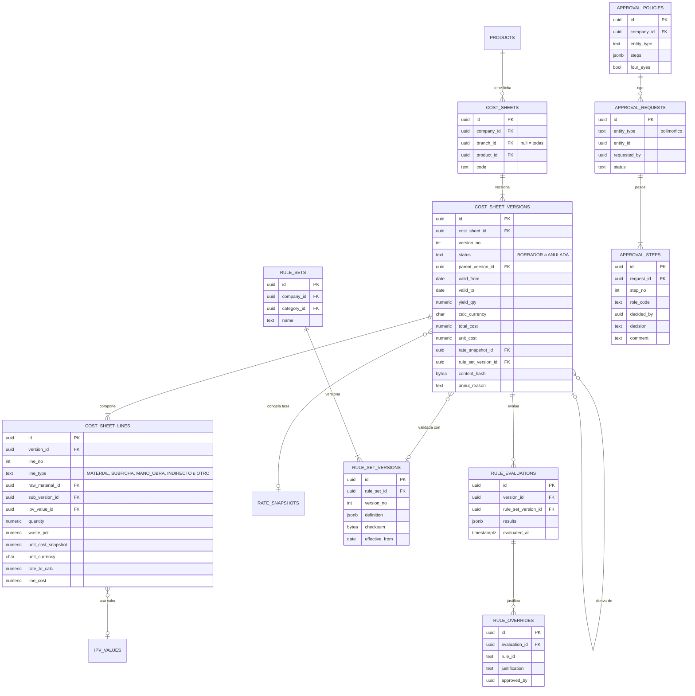
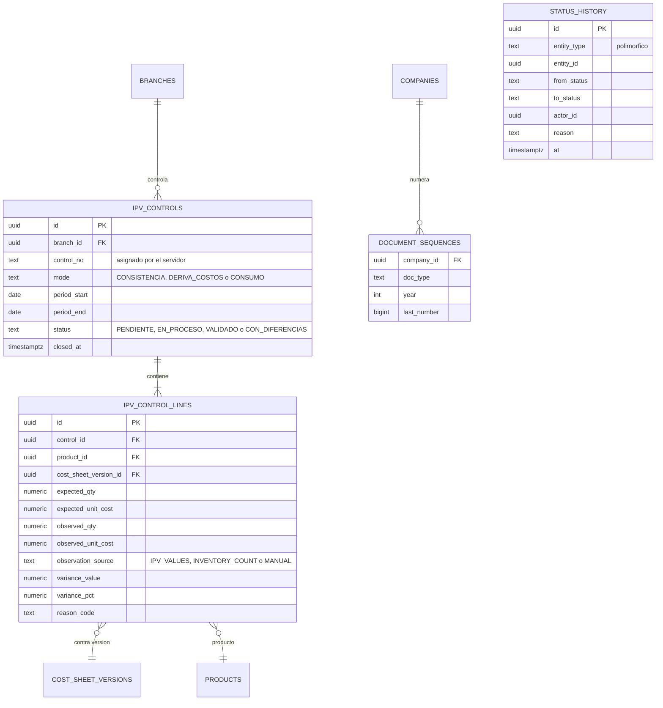
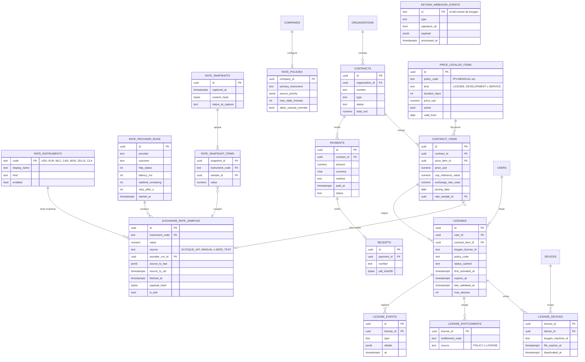
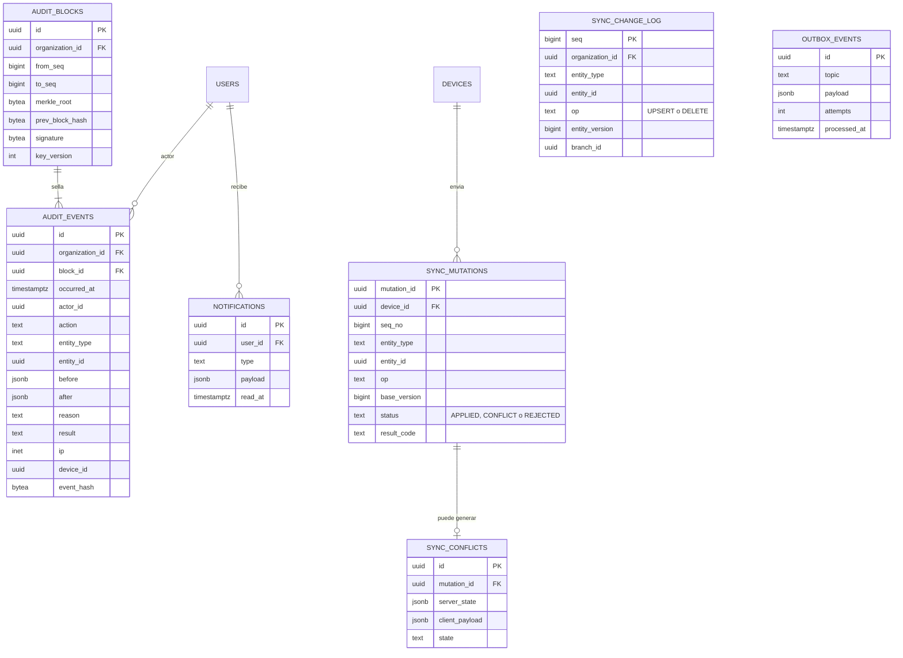

# 3. Modelo entidad‑relación

> Entregable §39‑3 · [Índice](README.md) · Modelo **lógico** para PostgreSQL (🧭 propuesta). Las migraciones reales (Flyway) se escriben en la Fase 2, tras validar este diseño.

## 3.1 Convenciones

**Columnas estándar** de toda tabla de negocio sincronizable (exigidas por el prompt: UUID, `createdAt`, `updatedAt`, `version`, `deletedAt`, `lastSyncedAt`, borrado lógico):

| Columna | Tipo | Regla |
|---|---|---|
| `id` | `uuid` PK | UUID v7; lo genera el cliente (offline) o el servidor. |
| `organization_id` | `uuid NOT NULL` | **Clave de tenencia**; RLS la usa en cada consulta. |
| `created_at` / `updated_at` | `timestamptz` | Hora **del servidor** al persistir. |
| `origin_created_at` | `timestamptz NULL` | Hora que *declara* el dispositivo (informativa, no confiable). |
| `version` | `bigint NOT NULL DEFAULT 1` | La incrementa el servidor en cada cambio; base de la concurrencia optimista (`ETag`/`If-Match`) y del sync. |
| `deleted_at` | `timestamptz NULL` | **Borrado lógico**. Los únicos parciales incluyen `WHERE deleted_at IS NULL`. |
| `created_by` / `updated_by` | `uuid` | Usuario autor. |
| `origin_device_id` | `uuid NULL` | Dispositivo de origen. |
| `last_synced_at` | — | **Solo en Room** (columna local por fila, junto con `sync_state`); el servidor registra `devices.last_sync_at`. |

**Tipos y precisión** (🧭, política exacta en [D‑25](16-decisiones-pendientes.md#d-25)): dinero `NUMERIC(19,4)`; cantidades `NUMERIC(19,6)`; tasas `NUMERIC(18,6)`; porcentajes `NUMERIC(9,6)`; monedas `CHAR(3)`; estados como `text` + `CHECK` (no enums nativos, más fáciles de migrar). Nunca `float`/`double`.

**Tiempo**: todo en UTC; la *fecha de negocio* (`business_date`) se deriva de la zona horaria de la empresa.

## 3.2 Glosario ES-EN

| Español (UI y documentos) | Inglés (tablas y código) |
|---|---|
| Organización (cliente) · Empresa · Sucursal | `organization` (tenant) · `company` · `branch` |
| Insumo / materia prima | `raw_material` |
| Producto o servicio | `product` (`kind = PRODUCT \| SERVICE`) |
| **Valor IPV** (precio/valor registrado y vigente) | `ipv_value` |
| Ficha de Costo · versión · línea | `cost_sheet` · `cost_sheet_version` · `cost_sheet_line` |
| **Control IPV** · línea de control | `ipv_control` · `ipv_control_line` |
| Tasa de referencia · instantánea de tasas | `exchange_rate_sample` · `rate_snapshot` |
| Licencia · dispositivo · derecho de uso | `license` · `device` · `entitlement` |
| Movimiento de inventario | `inventory_movement` |
| Rendimiento (raciones, copas, comensales) | `yield` |

> Los dos sentidos de "IPV" se separan a propósito ([D‑01](16-decisiones-pendientes.md#d-01)).

## 3.3 Diagramas

### 3.3.1 Tenencia, identidad y acceso

### 3.3.2 Catálogo, valores IPV e inventario

### 3.3.3 Fichas de Costo, reglas y aprobaciones

### 3.3.4 Control IPV

### 3.3.5 Tasas, comercial y licencias

### 3.3.6 Transversales: auditoría, sincronización y notificaciones

## 3.4 Invariantes y su aplicación

Estas reglas protegen la **corrección de datos** (prioridad 3). Cada una se aplica en la capa más baja posible (la base de datos) y se repite en el servicio para dar mensajes útiles.

| Id | Invariante | Aplicación 🧭 |
|---|---|---|
| I‑01 | Ninguna fila cruza organizaciones. | `organization_id NOT NULL`; **RLS forzado** (`FORCE ROW LEVEL SECURITY`; rol de la app sin `BYPASSRLS`); FK compuestas `(organization_id, id)`; pruebas de fuga. |
| I‑02 | A lo sumo **una versión VIGENTE** por ficha. | Índice único parcial `ON cost_sheet_versions(cost_sheet_id) WHERE status='VIGENTE' AND deleted_at IS NULL`. |
| I‑03 | `version_no` único por ficha. | `UNIQUE (cost_sheet_id, version_no)`. |
| I‑04 | La vigencia de versiones VIGENTE/REEMPLAZADA no se solapa. | `EXCLUDE USING gist (cost_sheet_id WITH =, daterange(valid_from, valid_to, '[)') WITH &&) WHERE status IN ('VIGENTE','REEMPLAZADA')` (extensión `btree_gist`). |
| I‑05 | El contenido queda **congelado** al salir de BORRADOR. | Trigger que rechaza `UPDATE/DELETE` sobre líneas y columnas de contenido salvo en BORRADOR; `content_hash` (SHA‑256 del JSON canónico) calculado al enviar y **re‑verificado** al validar, aprobar y activar. |
| I‑06 | Solo transiciones de estado válidas. | Tabla de transiciones permitidas + trigger sobre `status`; el cambio solo se hace vía casos de uso (nunca `UPDATE` directo). |
| I‑07 | El aprobador es distinto del autor cuando la política lo exige. | Servicio + `CHECK` en `approval_steps`. |
| I‑08 | Una línea de ficha **no pierde** su referencia ni su costo. | Referencia a `ipv_value_id` con `ON DELETE RESTRICT`; copia de `unit_cost_snapshot`, moneda y `rate_to_calc`. **Sin** `SET NULL`. |
| I‑09 | Una línea de control solo puede apuntar a una versión **no anulada y vigente para el período**. | Trigger al insertar + servicio: `status` ∈ {VIGENTE, REEMPLAZADA} (nunca ANULADA), `valid_from ≤ period_start` y (`valid_to IS NULL` o `period_end ≤ valid_to`). Caso offline: [doc 9](09-flujo-android-offline-sync.md#94-política-de-conflictos-por-entidad). |
| I‑10 | Los valores IPV no se solapan por sujeto, sucursal y moneda. | `EXCLUDE USING gist` sobre `daterange(valid_from, valid_to)`; exactamente uno de `raw_material_id`/`product_id` (`CHECK`). |
| I‑11 | Importes ≥ 0 y tasas > 0. | `CHECK` en columnas monetarias y de tasa. |
| I‑12 | Las muestras de tasa son **inmutables**. | Trigger contra `UPDATE/DELETE`; las correcciones son filas nuevas con `supersedes_id`. |
| I‑13 | Las instantáneas de tasas son inmutables y sin duplicados. | `content_hash UNIQUE`; `UNIQUE (snapshot_id, instrument_code)`. |
| I‑14 | La auditoría es **solo de anexado**. | El rol de la app solo tiene `INSERT`; trigger rechaza `UPDATE/DELETE/TRUNCATE`; verificación periódica de bloques ([doc 12](12-estrategia-auditoria.md)). |
| I‑15 | Una mutación de sync se aplica una sola vez. | `sync_mutations.mutation_id` PK; el resultado se guarda y se devuelve idéntico en reintentos. |
| I‑16 | Se borra de forma **lógica**. | `deleted_at`; `DELETE` físico solo para el rol del trabajo de retención. |
| I‑17 | El inventario es un **libro mayor de solo anexado**. | Sin `UPDATE/DELETE` en `inventory_movements`; correcciones por asientos de reversa; `stock_balances` se concilia por trabajo. |
| I‑18 | `keygen_license_id` es único; una licencia activa por (usuario, organización). | `UNIQUE` + índice parcial (regla exacta ⛔ [D‑10](16-decisiones-pendientes.md#d-10)). |
| I‑19 | Numeración de documentos sin duplicados por (empresa, tipo, año). | `document_sequences` actualizado con bloqueo de fila; **el número definitivo lo asigna el servidor** al sincronizar (en el dispositivo se muestra una referencia local). |
| I‑20 | Las monedas de las líneas pertenecen al conjunto permitido de la empresa. | `CHECK`/servicio (conjunto ⛔ [D‑27](16-decisiones-pendientes.md#d-27)). |

## 3.5 Catálogo de entidades

`R` = se replica a Android solo lectura · `RW` = lectura y escritura offline · `—` = nunca se replica.

### Tenencia, identidad y acceso

| Entidad | Propósito | Columnas/ideas clave | Android |
|---|---|---|---|
| `organizations` | Cliente/tenant. | `name`, `status`. Dueña de licencias y contratos. | — |
| `companies` | Entidad operadora. | `tax_id`, `base_currency`, `timezone`, `settings` (política de redondeo y de tasas). | R |
| `branches` | Sucursal/unidad. | `code`, `name`, `active`. | R |
| `users` | Personas con acceso. | `email` (`citext`, único por org), `password_hash` (Argon2id), `status`. | R (solo el propio perfil) |
| `mfa_factors` | Segundo factor. | Semilla TOTP **cifrada**; códigos de recuperación como *hash* aparte. | — |
| `roles`, `permissions`, `role_permissions` | RBAC. | Roles de sistema (`organization_id` nulo) y por organización. Permisos `modulo:accion` y `costs:view`. | R (capacidades del usuario) |
| `role_assignments` | Rol con alcance. | `scope_type` ∈ ORG/COMPANY/BRANCH, `scope_id`, vigencia. | R (propias) |
| `devices` | Dispositivos/instalaciones. | `platform`, `installation_hash` (nunca ID de hardware), `last_sync_at`. | — |
| `sessions` | Sesiones y *refresh tokens*. | Hash del token, `family_id` (detección de reutilización), revocación. | — |

### Catálogo e inventario

| Entidad | Propósito | Columnas/ideas clave | Android |
|---|---|---|---|
| `categories` | Bebidas, Comidas, Productos, Servicios y personalizadas. | `kind`, `parent_id`; enlaza conjuntos de reglas. | R |
| `units` | Unidades y conversión a la base. | `dimension`, `to_base_factor` (⛔ [D‑26](16-decisiones-pendientes.md#d-26)). | R |
| `suppliers` | Proveedores. | `tax_id`, contacto. | R |
| `raw_materials` | Identidad del insumo. | `code` único por empresa, unidad base, `min_stock`. | R |
| `products` | Productos y servicios. | `kind`, categoría, `code`. | R |
| `ipv_values` | **Valor IPV**: precio/valor vigente con respaldo documental (antes `materials`). | Moneda, `unit_price`, vigencia sin solape, `source_ref`, proveedor. | R |
| `warehouses` | Almacenes por sucursal. | — | R |
| `inventory_movements` | Libro mayor de inventario. | `type`, `quantity`, `business_date`, `mutation_id`. | RW |
| `stock_balances` | Saldos derivados. | Conciliados contra el libro. | R |
| `inventory_counts` (+ líneas) | Conteos físicos. | Origen de ajustes. | RW |

### Costeo, reglas y flujo

| Entidad | Propósito | Columnas/ideas clave | Android |
|---|---|---|---|
| `cost_sheets` | Identidad estable de la ficha de un producto. | `product_id`, `branch_id` (nulo = todas). | R |
| `cost_sheet_versions` | **Versión inmutable** con estado. | `version_no`, `status`, `valid_from/to`, rendimiento, totales, `rate_snapshot_id`, `rule_set_version_id`, `content_hash`, `parent_version_id`, sellos de envío/validación/aprobación/activación/anulación, `annul_reason`. Instantánea de tasa **nula en BORRADOR** y obligatoria después (`CHECK`). | R (RW solo en BORRADOR, etapa 6c) |
| `cost_sheet_lines` | Líneas de la versión. | `line_type`, material **o** subficha, `ipv_value_id`, cantidad, merma, `unit_cost_snapshot`, moneda, `rate_to_calc`, `line_cost`. Ciclos de subfichas detectados en el servicio. | R |
| `status_history` | Línea de tiempo de estados. | `from/to`, actor, motivo. | R |
| `approval_policies`, `approval_requests`, `approval_steps` | Aprobaciones configurables. | Pasos por rol, regla de cuatro ojos. | R (estado) |
| `rule_sets`, `rule_set_versions` | Reglas **versionadas e inmutables**. | `definition` JSON (DSL cerrado), `checksum`, vigencia. | R |
| `rule_evaluations`, `rule_overrides` | Resultado de validar y excepciones justificadas. | `results` (errores/avisos), justificación y aprobador. | R |

### Control IPV

| Entidad | Propósito | Columnas/ideas clave | Android |
|---|---|---|---|
| `ipv_controls` | Cabecera del control por sucursal y período. | `control_no` asignado por servidor, **`mode`** (qué se controla: ⛔ [D‑01](16-decisiones-pendientes.md#d-01); ver [doc 6](06-flujo-ficha-ipv.md#67-control-ipv)), período, estado. | RW |
| `ipv_control_lines` | Contraste **esperado vs observado** (neutro respecto al modo). | `cost_sheet_version_id` (no 1:1), esperado **copiado** de la versión (instantánea), observado + `observation_source`, varianza, causa. | RW |
| `document_sequences` | Numeración. | `(company, doc_type, year)`. | — |

### Tasas, comercial y licencias

| Entidad | Propósito | Columnas/ideas clave | Android |
|---|---|---|---|
| `rate_instruments` | Instrumentos (USD, EUR, MLC, CAD, MXN, ZELLE, CLA…) con su **etiqueta tal como la da la fuente**. | `kind` ⛔ (no se interpreta qué es MLC/ZELLE/CLA más allá de la etiqueta de elTOQUE). | R |
| `rate_provider_mappings` | Correspondencia código del proveedor → instrumento (p. ej. `ECU` → `EUR`). | Se rellena y valida con el contrato real (spike S‑2). | — |
| `exchange_rate_samples` | Muestras inmutables de cada fuente. | `source`, `value`, `source_ts_raw`, `source_ts_utc` (nulo hasta confirmar zona horaria), `fetched_at`, `payload_hash`, `is_test`. | R (últimas) |
| `exchange_rate_current` | Puntero a la muestra vigente por instrumento + estado. | `FRESH/STALE/CACHED/UNAVAILABLE/MANUAL/TEST`. | R |
| `rate_provider_runs` | Bitácora de cada llamada al proveedor. | Resultado, HTTP, latencia, cuota restante, `retry_after`. | — |
| `rate_snapshots`, `rate_snapshot_items` | **Instantánea inmutable** de tasas citada por fichas y contratos. | `content_hash` único; sin `organization_id` (datos no sensibles y deduplicados). | R |
| `rate_policies` | Política de tasas por empresa. | Instrumento principal, prioridad de fuentes, vejez máxima, permiso de tasa manual. | R |
| `price_catalog_items` | Precios de políticas de licencia, desarrollo y servicios, **editables sin código**. | `policy_code`, `duration_days`, `price_usd`, vigencia (el historial son filas nuevas). | — |
| `contracts`, `contract_items`, `payments`, `receipts` | Cliente, contrato, precio, moneda, pago y comprobante (**Keygen no es facturación**). | `price_usd`, `cup_reference_value`, `exchange_rate_used`, `pricing_date`, `rate_sample_id`. | — |
| `licenses` | Espejo de la licencia de Keygen, por **usuario**. | `keygen_license_id`, política, estado en caché, expiración, `max_devices`, motivos de suspensión/revocación. **No** guarda la clave de licencia. | R (propia) |
| `license_devices`, `license_entitlements`, `license_events` | Dispositivos activados, derechos y bitácora. | `keygen_machine_id`, `file_expires_at`. | R (propios) |
| `keygen_webhook_events` | Eventos entrantes con firma verificada. | `id` de Keygen como PK (idempotencia). | — |

### Transversales

| Entidad | Propósito | Android |
|---|---|---|
| `audit_events`, `audit_blocks` | Auditoría de solo anexado, sellada por bloques ([doc 12](12-estrategia-auditoria.md)). | — |
| `sync_change_log` | Cursor monótono de cambios por organización/sucursal. | — |
| `sync_mutations`, `sync_conflicts` | Idempotencia y conflictos revisables. | — (el cliente tiene su `outbox`) |
| `notifications`, `outbox_events` | Bandeja del usuario y publicación fiable de eventos. | R |

## 3.6 Qué se replica a Android

- **Alcance**: solo lo que el usuario puede ver según su rol, empresa y sucursal; los datos de costos se envían solo si tiene `costs:view`.
- **Escritura offline** (`RW`): conteos de inventario, movimientos y líneas de Control IPV, y —en la etapa 6c— borradores de ficha. **Nunca** se escriben offline los cambios de estado de una ficha ([ADR‑0001](adr/0001-reabrir-offline-y-multisucursal.md#5-despliegue-escalonado)).
- **Nunca** en el dispositivo: auditoría, contratos, pagos, sesiones, datos de otros usuarios.
- Al revocarse un permiso o salir un dato del alcance, el servidor envía una **lápida** (`DELETE` en `sync_change_log`) y el cliente lo retira.

## 3.7 Migraciones y semillas

- **Flyway** con migraciones SQL versionadas e inmutables; cada migración con prueba en Testcontainers.
- **Semilla 100 % sintética** (generador reproducible): organizaciones, empresas, sucursales, usuarios por rol, catálogo, valores IPV, fichas en cada estado y tasas de prueba marcadas `is_test = true`. No se importan datos ni credenciales de los repos origen ([C‑11](01-analisis-arquitectonico.md#c-11)).
- Las **políticas y derechos de Keygen** no son SQL: se aprovisionan con un script idempotente ([doc 7](07-flujo-licencias-keygen.md)).
