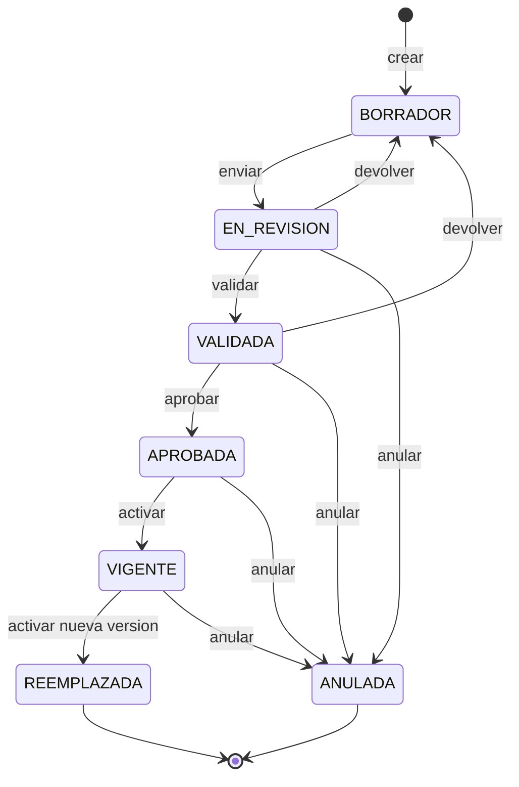
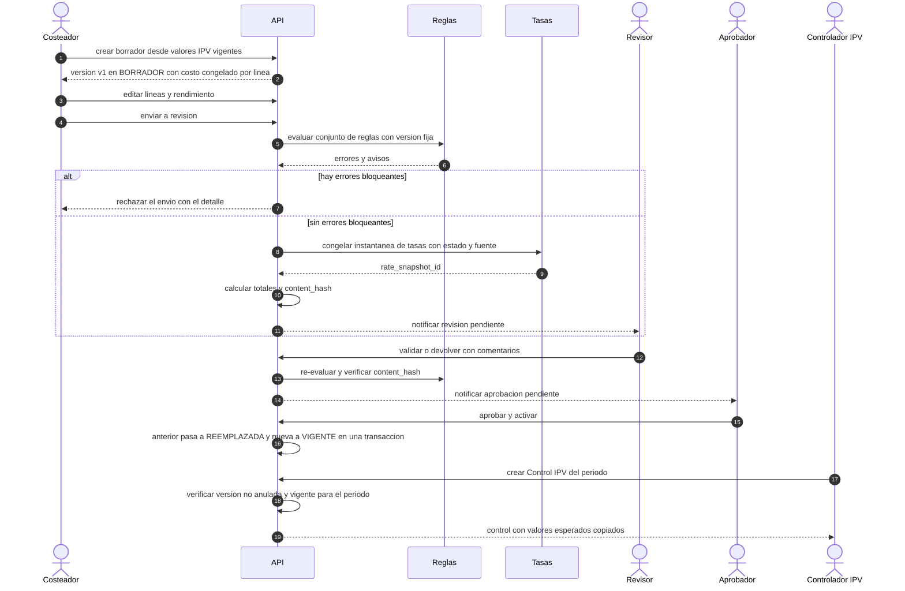

# 6. Flujo Ficha de Costo ↔ IPV

> Entregable §39‑6 · [Índice](README.md) · Modelo de datos: [doc 3](03-modelo-er.md). Todo lo no confirmado por una fuente normativa está marcado ⛔.

## 6.1 Vocabulario y el orden "IPV ↔ Ficha"

El código existente usa "IPV" con **dos sentidos** (🔎 [H‑09](01-analisis-arquitectonico.md#12-hallazgos-que-más-condicionan-el-diseño)):

| Concepto | Qué es | Cuándo ocurre | Tabla nueva |
|---|---|---|---|
| **Valor IPV** | Precio/valor registrado y vigente de un insumo, producto o servicio, con respaldo documental. En IPV es la tabla `materials` ("Valores del IPV"). | **Antes** de elaborar la Ficha (el usuario describe el IPV como el registro previo). | `ipv_values` |
| **Control IPV** | Verificación periódica de una Ficha ya vigente. | **Después** de aprobar/activar la Ficha. | `ipv_controls` |

Así, la descripción del usuario (*"el IPV se usa para registrar y controlar los costos antes de elaborar la Ficha de Costo"*) y el flujo del prompt (*Ficha → IPV*) **pueden ser compatibles**: el *valor* precede y el *control* sigue. Es una **hipótesis a confirmar** ([D‑01](16-decisiones-pendientes.md#d-01)); por eso:

- Los dos objetos están separados y enlazados **por versión de ficha** (no 1:1).
- El orden obligatorio es una **política configurable por empresa**, no código fijo:

| Política (por empresa) | Valor por defecto 🧭 | Efecto |
|---|---|---|
| `lines_require_ipv_value` | `true` | Cada línea de ficha debe referenciar un Valor IPV vigente. |
| `control_requires_active_sheet` | `true` | Un control solo puede apuntar a una versión vigente para su período. |
| `ipv_control_mode` | `CONSISTENCIA` | Qué compara el control ([§6.7](#67-control-ipv)). |

## 6.2 Estados de la Ficha de Costo



- **Descartar un borrador** no es un estado: es un borrado lógico auditado (`deleted_at`).
- **VENCIDA** no es un estado: es una condición **derivada** (`valid_to` ya pasó sin reemplazo) que se muestra como etiqueta y **bloquea nuevos controles** igual que ANULADA.
- **Reactivar una versión antigua no existe**: se crea una *nueva versión* a partir de ella (§6.4).

## 6.3 Transiciones

Los permisos usan los nombres de [doc 11](11-estrategia-seguridad.md#115-autorización-rbac--abac). Las transiciones son **comandos del servidor** con `If-Match: version`; ninguna se ejecuta offline.

| Transición | Quién (permiso) | Precondiciones | Efectos | Auditoría |
|---|---|---|---|---|
| BORRADOR → EN_REVISIÓN | `costing:submit` | Reglas **sin errores bloqueantes**; todas las líneas con valor IPV vigente (si la política lo exige); rendimiento > 0. | **Congela instantánea de tasas**; recalcula totales; fija `rule_set_version_id` y `content_hash`; contenido pasa a solo lectura; crea solicitud de aprobación; notifica. | Antes/después, hash, versión de reglas, tasa usada. |
| EN_REVISIÓN → BORRADOR | `costing:validate` | **Comentario obligatorio**. | Descongela; limpia `content_hash` y `rate_snapshot_id` (el histórico queda en `status_history`). | Motivo + comentario. |
| EN_REVISIÓN → VALIDADA | `costing:validate` | Re‑evaluación de reglas OK; **`content_hash` coincide**; revisor ≠ autor si la política lo exige. | Registra validador y fecha. | Resultado de la evaluación. |
| VALIDADA → BORRADOR | `costing:approve` | Comentario obligatorio. | Igual que arriba. | Motivo. |
| VALIDADA → APROBADA | `costing:approve` | Hash íntegro; reglas OK; aprobador ≠ autor (y ≠ validador si la política lo exige); **instantánea de tasas no más vieja** que el límite de la política ([D‑03](16-decisiones-pendientes.md#d-03)). | Registra aprobador y fecha. | Hash verificado. |
| APROBADA → VIGENTE | `costing:activate` | `valid_from` informado y **no anterior** a la vigente actual (retroactividad solo con permiso y motivo, ⛔ [D‑14](16-decisiones-pendientes.md#d-14)). | **En la misma transacción**: la VIGENTE previa pasa a REEMPLAZADA con `valid_to = valid_from` nuevo. Si `valid_from` es futura, la versión **espera como APROBADA** y un trabajo idempotente la activa ese día. | Ambas versiones, antes/después. |
| EN_REVISIÓN/VALIDADA/APROBADA/VIGENTE → ANULADA | `costing:annul` | **Motivo obligatorio**. | Irreversible. Bloquea nuevas líneas de control; avisa a controles abiertos. Si era la vigente, el producto queda **sin ficha vigente** (alerta). | Motivo, actor, controles afectados. |

**Concurrencia**: cada comando bloquea la fila de la ficha (`SELECT … FOR UPDATE`) y valida `version`. Aunque dos aprobadores activen a la vez, el **índice único parcial** (I‑02) impide dos VIGENTE.

## 6.4 Versionado

1. La identidad estable es `cost_sheets`; cada cambio de contenido vive en una **versión** (`cost_sheet_versions`).
2. **Editar lo aprobado no se permite**: se crea una **nueva versión** con `POST /cost-sheets/{id}/versions {from_version_id}`: copia líneas, fija `parent_version_id`, asigna `version_no = max + 1` (lo asigna el servidor) y arranca en BORRADOR.
3. **Un solo borrador abierto** por ficha (índice único parcial sobre estados abiertos) para evitar ramas paralelas. Si dos dispositivos crean un borrador a la vez, el segundo queda en conflicto visible ([doc 9](09-flujo-android-offline-sync.md#94-política-de-conflictos-por-entidad)).
4. **Nada se sobrescribe**: las versiones aprobadas son inmutables ([I‑05](03-modelo-er.md#34-invariantes-y-su-aplicación)); el borrado es lógico.
5. **Cambio de precios**: modificar un Valor IPV **no altera** fichas aprobadas (tienen su `unit_cost_snapshot`). El sistema solo **señala** fichas desactualizadas y propone crear una nueva versión (revaluación).

## 6.5 Instantáneas (qué se congela y cuándo)

| Dato | Cuándo se congela | Dónde | Por qué |
|---|---|---|---|
| Costo unitario de cada línea | Al **crear/editar** la línea (copia del Valor IPV elegido, con su moneda) | `cost_sheet_lines.unit_cost_snapshot` + `ipv_value_id` | Trazabilidad aunque el precio cambie después. |
| **Tasa de cambio** | Al **enviar a revisión** | `rate_snapshot_id` → `rate_snapshots` (con estado y fuente de cada tasa) | La tasa *actual* no es la *histórica*: la ficha conserva la que usó. |
| Reglas aplicadas | Al enviar (y re‑evaluación al validar/aprobar) | `rule_set_version_id`, `rule_evaluations` | La validación debe ser reproducible. |
| Contenido completo | Al enviar | `content_hash` (SHA‑256 del JSON canónico) | Detectar manipulación fuera del flujo. |

Si la tasa de la instantánea está **en caché o es manual**, queda registrado en la propia instantánea (`status_at_capture`) y se muestra en la ficha con la etiqueta correspondiente ([doc 10](10-flujo-eltoque-cache.md)). La **política de qué tasa vale para documentos oficiales** es ⛔ [D‑03](16-decisiones-pendientes.md#d-03).

## 6.6 Motor de reglas

- **Qué es**: conjuntos de reglas **versionadas e inmutables** en un **DSL JSON cerrado** (operadores y funciones fijas, sin código arbitrario), evaluado por un intérprete determinista de `core:domain`, igual en servidor y Android.
- **Alcance**: por empresa y, opcionalmente, por categoría (Bebidas, Comidas, Productos, Servicios o personalizadas).
- **Severidad**: `ERROR` (bloquea la transición), `WARNING` (exige justificación registrada en `rule_overrides`), `INFO`.
- **Forma de una regla** (ejemplo **ilustrativo**; los valores los define la empresa y **no son normas oficiales**):

```json
{
  "id": "R-COSTO-RELATIVO",
  "applies_to": { "category_kind": ["COMIDAS", "BEBIDAS"] },
  "assert": { "op": "lte",
              "left":  { "ref": "unit_cost" },
              "right": { "mul": [ { "ref": "target_price" }, { "param": "max_cost_ratio" } ] } },
  "severity": "WARNING",
  "params": { "max_cost_ratio": "(lo define la empresa)" },
  "message_key": "rules.cost_ratio_exceeded"
}
```

**Plantillas estructurales incluidas** (verifican consistencia, **no** cumplimiento legal):

| Regla | Severidad |
|---|---|
| Línea sin Valor IPV vigente a la fecha | ERROR |
| Unidad de la línea incompatible con la del Valor IPV | ERROR |
| Cantidad ≤ 0 o rendimiento ≤ 0 | ERROR |
| Moneda de la línea fuera de las permitidas por la empresa | ERROR |
| Subficha anulada o vencida | ERROR |
| Instantánea de tasas más vieja que el límite configurado | WARNING |
| Costo unitario varía más de un umbral respecto a la versión anterior | WARNING (exige justificación) |
| Rendimiento no definido en la unidad esperada para la categoría | WARNING |
| Servicios sin ninguna línea de mano de obra o indirecto | WARNING |

Las reglas **específicas** por categoría (Bebidas/Comidas/Servicios) deben salir de la normativa aplicable, que es ⛔ [D‑02](16-decisiones-pendientes.md#d-02). Hasta entonces el sistema no impone fórmulas legales.

## 6.7 Control IPV

**Línea base observada en IPV** 🔎: un control se crea **desde una ficha** para un período `AAAA‑MM`; copia las líneas de la ficha (`control_items`) y registra `snapshot_total`; al validar comprueba que (a) hay líneas, (b) la suma de líneas = total registrado y (c) total registrado = total de la ficha; estados *Pendiente / Validado / Con diferencias*; único por (ficha, período). Es un control de **coherencia**, no compara cantidades reales.

El prompt exige que el control se ligue a **versiones** de ficha (no 1:1). Como el contenido del control no está definido ([D‑01](16-decisiones-pendientes.md#d-01)), el modelo es **neutro** y admite modos (`ipv_controls.mode`):

| Modo | Compara | Datos necesarios | Fase |
|---|---|---|---|
| `CONSISTENCIA` (comportamiento actual) | Instantánea copiada vs total de la versión | Solo la ficha | 3 |
| `DERIVA_COSTOS` | Costo de la versión vs Valores IPV y tasa **vigentes hoy** (detecta fichas desactualizadas) | Valores IPV, tasas | 3 |
| `CONSUMO` | Cantidades teóricas de la ficha vs consumo/stock observado | Inventario/ventas (Cuadre) | 6+ |

**Reglas comunes**

1. **Creación**: una línea apunta a una versión con estado VIGENTE o REEMPLAZADA, **nunca** ANULADA, y vigente para el período: `valid_from ≤ period_start` y (`valid_to` nulo o `period_end ≤ valid_to`). Una versión **VENCIDA** o **ANULADA** bloquea nuevas líneas ([I‑09](03-modelo-er.md#34-invariantes-y-su-aplicación)).
2. **Esperado copiado**: `expected_*` es una **copia** tomada de la versión al crear la línea; cambios posteriores no la mueven.
3. **Varianza**: `variance_value = observed_value − expected_value`; `variance_pct = variance_value / expected_value` (si `expected_value ≠ 0`). Tolerancias y causas (`reason_code`) configurables ⛔.
4. **Estados**: PENDIENTE → EN_PROCESO → VALIDADO | CON_DIFERENCIAS; al cerrar el período queda inmutable.
5. **Numeración**: `IPV‑AAAA‑NNNN` asignada **por el servidor** con contador bloqueado (`document_sequences`); en el dispositivo se muestra una referencia local hasta sincronizar. (IPV hoy calcula el siguiente código leyendo el último registrado; con PostgreSQL y varios escritores concurrentes eso necesita un contador bloqueado, que es lo que se propone.)
6. **Período que cruza dos versiones** (se reemplazó la ficha a mitad de período): una línea por versión con su tramo de fechas, o comparar con la versión vigente al cierre — ⛔ [D‑01](16-decisiones-pendientes.md#d-01).

## 6.8 Flujo extremo a extremo



## 6.9 Casos límite

| Situación | Comportamiento 🧭 |
|---|---|
| La tasa cambia después de aprobar | La ficha **no cambia** (usa su instantánea). Se ofrece **revaluar** creando una versión nueva con instantánea nueva. |
| Cambia el precio de un insumo (nuevo Valor IPV) | Las aprobadas no cambian; las fichas afectadas se **señalan** y los borradores pueden refrescar la línea. |
| Se anula una ficha con controles existentes | Las líneas existentes **se conservan** (historia) marcadas `version_annulled`; no se aceptan líneas nuevas; los controles abiertos se notifican. |
| Subficha anulada o reemplazada | Las fichas que la usan se marcan **"requiere revisión"** (⛔ [D‑14](16-decisiones-pendientes.md#d-14): ¿cascada automática o manual?). |
| Control creado offline sobre una versión anulada mientras tanto | Línea `REJECTED: FICHA_ANULADA`; se conserva en el dispositivo para decidir; no se pierde ([doc 9](09-flujo-android-offline-sync.md)). |
| Dos aprobadores activan a la vez | Gana uno; el otro recibe conflicto de versión; el índice único impide duplicados. |
| Activación futura | Queda APROBADA; el trabajo programado activa en la fecha de negocio (zona horaria de la empresa), de forma idempotente. |
| Ficha sin vigente (por anulación) | Alerta destacada; los controles nuevos del producto quedan bloqueados hasta activar otra. |
| Borrado | Solo lógico; la purga física es una operación de retención separada y auditada ([D‑17](16-decisiones-pendientes.md#d-17)). |

## 6.10 Aritmética base

**Comportamiento actual de IPV** 🔎 (se conserva como línea base hasta decidir [D‑25](16-decisiones-pendientes.md#d-25)):

```text
subtotal_línea = redondear_centavo( cantidad × costo_unitario )     # ROUND_HALF_UP, por línea
total          = Σ subtotal_línea
costo_por_unidad_de_rendimiento = redondear_centavo( total / rendimiento )
```

**Con moneda y tasa** (extensión propuesta 🧭): `costo_unitario_en_moneda_de_cálculo = unit_cost_snapshot × rate_to_calc`, donde `rate_to_calc = 1` si la línea ya está en la moneda de cálculo.

**No se codifica** ninguna fórmula legal ni contable adicional: **margen, precio de venta sugerido, costos indirectos, prorrateos y merma** no existen en los repos origen; los campos opcionales (`target_price`, `margin_pct`, `waste_pct`) están desactivados por defecto y su semántica es ⛔ ([D‑02](16-decisiones-pendientes.md#d-02), [D‑26](16-decisiones-pendientes.md#d-26)). Todo cálculo vive en `core:domain` y se prueba con **vectores dorados** y pruebas de propiedades (suma de líneas = total; redondeo estable; sin pérdida por orden de líneas).
