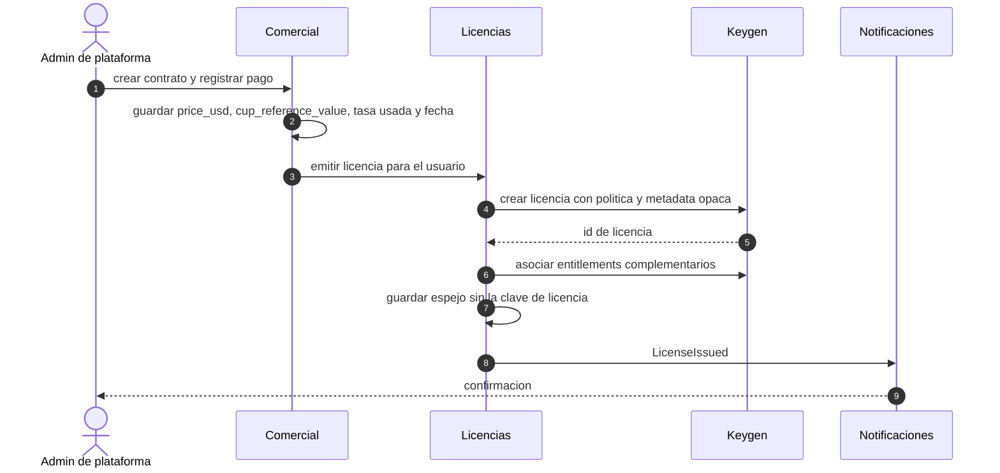
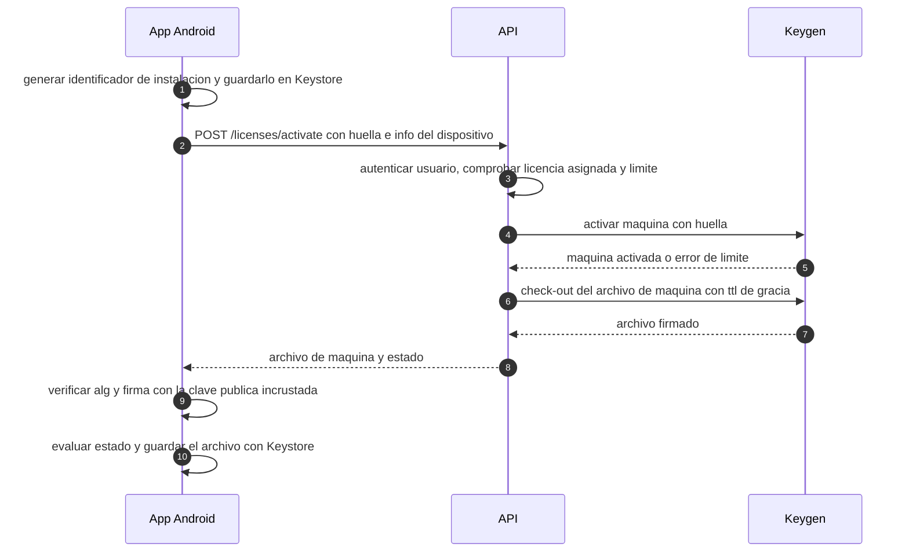

# 7. Flujo de licencias con Keygen

> Entregable §39‑7 · [Índice](README.md) · Renovación: [doc 8](08-flujo-renovacion.md) · Fuentes: [anexo B](anexos/B-fuentes-y-verificaciones.md#b2-keygen). ✅ = verificado en la documentación oficial; 🧭 = propuesta; ⛔ = pendiente.

## 7.1 Principios

1. **Usar lo nativo de Keygen** (políticas, expiración, renovación, máquinas, archivos firmados, entitlements) en lugar de reimplementarlo.
2. **Nunca confiar en el reloj local ni en una bandera "premium"**: el estado se **recalcula** a partir de un archivo firmado verificado con clave pública.
3. **Keygen no es facturación**: cliente, contrato, precio, moneda, pago y recibo viven en nuestro sistema ([doc 8](08-flujo-renovacion.md)).
4. **Solo el servidor habla con Keygen.** Ni Web ni Android reciben tokens de Keygen.
5. **Proveedor intercambiable** (`LicenseProvider`): Keygen Cloud, Keygen CE o un proveedor propio con el mismo formato de archivo, por si falla la disponibilidad o la revisión legal ([D‑05](16-decisiones-pendientes.md#d-05), [R‑01](14-riesgos.md#r-01)).

| Lo hace Keygen ✅ | Lo hacemos nosotros |
|---|---|
| Políticas, duración, expiración, renovación | Catálogo de precios, contratos, pagos, recibos, tasa y equivalente en CUP |
| Máquinas y límites de dispositivos | Identificador de instalación, UX de dispositivos, sesiones web |
| Entitlements | **Aplicación** de los derechos en servidor y cliente |
| Archivos de licencia/máquina firmados con TTL | Verificación en el dispositivo, evaluador de estados, integridad del reloj |
| Validación (`VALID`, `EXPIRED`, `SUSPENDED`…) | Mapeo a los 7 estados de producto y comportamiento por estado |
| *Webhooks* firmados | Verificación, idempotencia, conciliación |

## 7.2 Modelo de licenciamiento

### Producto y políticas

Un **producto** Keygen ("IPV Gestión de Costos") con **seis políticas**. Atributos que existen en la API ✅ y valores propuestos 🧭:

| Atributo | Valor propuesto | Motivo |
|---|---|---|
| `duration` | 604 800 · 2 592 000 · 7 776 000 · 15 552 000 · 31 536 000 · 63 072 000 s | 7, 30, 90, 180, 365 y 730 días |
| `expirationBasis` | `FROM_FIRST_ACTIVATION` | Mandato: la vigencia cuenta desde la primera activación |
| `renewalBasis` | `FROM_EXPIRY` | Mandato: renovar desde la expiración (advertencia de renovación tardía: [doc 8](08-flujo-renovacion.md#82-escenarios-con-ejemplos), ⛔ [D‑12](16-decisiones-pendientes.md#d-12)) |
| `expirationStrategy` | `REVOKE_ACCESS` | Mandato: vencida = sin acceso |
| `scheme` | `ECDSA_P256_SIGN` (o `ED25519_SIGN`, recomendado por Keygen) | ECDSA es nativo en la JCA de Android; verificar en el spike S‑1 |
| `strict` | `true` | Una licencia sin dispositivo activado **no** valida |
| `floating` / `maxMachines` | `true` / `2` | Android: 1 licencia / 2 dispositivos por defecto, configurable (⛔ [D‑10](16-decisiones-pendientes.md#d-10)); piloto: 1 |
| `overageStrategy` | `NO_OVERAGE` | Sin dispositivos por encima del límite |
| `requireFingerprintScope` | `true` | Toda validación indica el dispositivo |
| `machineUniquenessStrategy` | `UNIQUE_PER_LICENSE` | Un identificador no se repite dentro de la licencia |
| `protected` | `true` | Solo tokens administrativos/de producto crean licencias |
| `authenticationStrategy` | `TOKEN` | La clave de licencia por sí sola **no** autentica llamadas |
| `transferStrategy` | `RESET_EXPIRY` en las políticas de pago | Conversión *trial → pago* (confirmar semántica en S‑1) |

> Los **nombres** de atributo y de estrategia están en la documentación oficial ✅; los **valores** de la columna central son propuesta 🧭 y la semántica exacta de `protected`, `authenticationStrategy`, `transferStrategy` y `machineMatchingStrategy` se confirma en el spike S‑1 antes de aprovisionar nada.

| Política | Duración | Precio USD (catálogo editable) |
|---|---|---|
| `IPV-TRIAL-7D` | 7 días | 25 |
| `IPV-MENSUAL` | 30 días | 75 |
| `IPV-TRIMESTRAL` | 90 días | 195 |
| `IPV-SEMESTRAL` | 180 días | 360 |
| `IPV-ANUAL` | 365 días | 600 |
| `IPV-BIENAL` | 730 días | 1 020 |

Los precios **no** viven en Keygen: están en `price_catalog_items`, editables sin tocar código ([doc 8](08-flujo-renovacion.md#84-registro-comercial-y-equivalente-en-cup)).

> **Implicación de `FROM_FIRST_ACTIVATION`** ✅: la licencia **no vence hasta activarse**. Con `strict = true` no valida sin dispositivo, pero una licencia vendida y nunca activada no caduca por sí sola. Regla propia 🧭: plazo máximo para activar tras la compra (si no, el sistema la suspende) — ⛔ [D‑11](16-decisiones-pendientes.md#d-11).

### Entitlements (11)

`IPV_BASIC · IPV_ADVANCED · COST_SHEETS · REPORTS · MULTI_COMPANY · MULTI_BRANCH · ANDROID_ACCESS · WEB_ACCESS · API_ACCESS · ADVANCED_AUDIT · DATA_EXPORT`

Empaquetado **provisional** ⛔ [D‑09](16-decisiones-pendientes.md#d-09): *base de todas las políticas* = `IPV_BASIC`, `COST_SHEETS`, `REPORTS`, `ANDROID_ACCESS`, `WEB_ACCESS`; *complementos por licencia* (se asocian a la licencia, no a la política) = `IPV_ADVANCED`, `MULTI_COMPANY`, `MULTI_BRANCH`, `API_ACCESS`, `ADVANCED_AUDIT`, `DATA_EXPORT`.

### Titular, dispositivos y sesiones web

- **Licencia por usuario**: una licencia por persona. En Keygen solo se guardan **identificadores opacos** en `metadata` (`organization_id`, `user_id`, `contract_item_id`); **sin correo ni nombre** (menos datos personales fuera del país).
- **Android**: cada instalación es una *máquina*; `fingerprint` = identificador aleatorio de instalación guardado con Keystore (**no** IMEI/serie: Android lo restringe y es invasivo). Se pierde al desinstalar o borrar datos → ocupa un cupo nuevo; el usuario puede **desactivar** dispositivos desde la web o la app, y el administrador también. `allowBackup=false` evita clonar la identidad por copia de seguridad.
- **Web (decisión de estrategia)**: un navegador **no** es una máquina (se borran cookies, hay perfiles, incógnito). Propuesta 🧭 (⛔ [D‑10](16-decisiones-pendientes.md#d-10)):
  - Se registra **una sola máquina lógica "asiento web"** por licencia (`fingerprint = web:<license_uuid>`), creada en el **primer acceso web** (así también arranca el reloj `FROM_FIRST_ACTIVATION` para usuarios solo‑web).
  - Los navegadores son **sesiones** nuestras con un **tope configurable de sesiones simultáneas** por usuario.
  - El acceso web exige `WEB_ACCESS`; no hay archivo offline (la web requiere conexión).

## 7.3 Integración: el puerto `LicenseProvider`

```kotlin
interface LicenseProvider {
    fun createLicense(req: CreateLicense): ProviderLicense
    fun validate(licenseId: String, fingerprint: String?): Validation   // code + expiry + entitlements
    fun activateMachine(licenseId: String, fingerprint: String, meta: DeviceMeta): ProviderMachine
    fun deactivateMachine(machineId: String)
    fun checkoutMachineFile(machineId: String, ttl: Duration): SignedFile
    fun renew(licenseId: String, idempotencyKey: String): ProviderLicense
    fun suspend(licenseId: String); fun reinstate(licenseId: String); fun revoke(licenseId: String)
}
```

| Adaptador | Uso |
|---|---|
| `KeygenProvider(baseUrl)` | Keygen Cloud **o** Keygen CE (misma API REST, distinta URL). |
| `InHouseProvider` | Plan B: mismo formato de archivo firmado (ECDSA), emitido por nuestro servidor. |
| `FakeProvider` | Pruebas: no toca la red. |

Controles: lista blanca de destino, TLS, *timeouts*, reintentos con *backoff* e **idempotencia**, límite de concurrencia, *circuit breaker*, token de producto guardado solo en el servidor ([doc 20](20-secretos-y-configuracion.md)).

## 7.4 Flujos

### 7.4.1 Aprovisionamiento (una vez por entorno)

Un script **idempotente** y versionado (`deploy/keygen/policies.yaml` + CLI) crea producto, políticas y entitlements con `--dry-run`, y falla si la política existente difiere de lo declarado. Nada de configuración manual en el panel.

### 7.4.2 Emisión



### 7.4.3 Activación en Android



### 7.4.4 Validación periódica y renovación del archivo

- La app intenta **refrescar el archivo** cuando hay conexión y le queda **menos del 50 % del TTL**, en cada inicio con red y al sincronizar.
- El servidor **valida** en cada inicio de sesión web y en cada renovación de token (caché corta); si el estado no es válido responde `403 LICENSE_<estado>`.
- TTL del archivo = **periodo de gracia offline**, configurable entre **7 y 15 días** (`LICENSE_OFFLINE_GRACE_DAYS`; Keygen exige ≥ 1 h y recomienda no usar TTL nulo ✅). A menor TTL, la suspensión/revocación llega antes a dispositivos sin red; a mayor TTL, más tolerancia offline ([T‑05](15-trade-offs.md#t-05)).

### 7.4.5 Verificación offline en el dispositivo

Pasos, **en este orden** y sin usar el contenido hasta superar el 3 ✅:

1. Leer el certificado (`-----BEGIN MACHINE FILE-----`), decodificar Base64 y obtener `{enc, sig, alg}`.
2. **Comprobar que `alg` es exactamente el esperado** (p. ej. `base64+ecdsa-p256`); si no, rechazar.
3. Verificar `sig` sobre la cadena `machine/` + `enc` con la **clave pública incrustada en el código** (no en archivos ni entorno ✅).
4. Leer `meta.issued`, `meta.expiry`, `meta.ttl` y los datos de la máquina/licencia.
5. Comprobar que la **huella** del archivo coincide con la del dispositivo y que la licencia es la esperada.
6. Aplicar el **reloj fiable** (§7.5) y evaluar el estado (§7.6).

Resultado: el estado **no se guarda como booleano**; se recalcula cada vez que se abre la app, vuelve a primer plano o pasa el tiempo.

### 7.4.6 Suspensión, revocación y *webhooks*

- Los eventos de Keygen llegan a `POST /webhooks/keygen`: se **verifica la firma** ✅ (clave pública de la cuenta), se guarda el `id` del evento como clave primaria (**idempotencia**) y se aplica en orden por licencia; los eventos desordenados se resuelven consultando el estado actual al proveedor.
- Nombres exactos de eventos: confirmar en la documentación de *webhooks* durante el spike S‑1.
- **Latencia**: un dispositivo sin red se entera al reconectarse o cuando expira su archivo; el servidor **sí** bloquea de inmediato cualquier petición.
- Una **revocación** es terminal (no se renueva): se emite otra licencia.

### 7.4.7 Gestión de dispositivos

Listar, renombrar y **desactivar** dispositivos (usuario o administrador); al desactivar, el servidor llama al proveedor y la app, al reconectar, descubre `DEVICE_DEACTIVATED` y elimina su archivo. Todo queda en `license_events` y en auditoría.

## 7.5 Integridad del reloj (offline)

Un reloj retrocedido no debe "alargar" una licencia. Control propuesto 🧭 (un SDK de Python **de terceros** para Keygen incluye una comprobación similar, `SystemClockUnsyncedError`; no consta en la documentación oficial leída):

```text
al abrir / volver a primer plano:
  wall = hora del sistema
  si wall < ultimaHoraVista - TOLERANCIA          → RELOJ_INCONSISTENTE
  si wall < archivo.meta.issued - TOLERANCIA      → RELOJ_INCONSISTENTE
  ultimaHoraVista = max(ultimaHoraVista, wall)
en cada respuesta HTTPS válida:
  horaServidor = cabecera Date;  guardar (horaServidor, elapsedRealtime)
hora fiable = horaServidor + (elapsedRealtime - base)   mientras no haya reinicio; tras reiniciar, vale la hora del sistema comprobada contra ultimaHoraVista
```

`RELOJ_INCONSISTENTE` exige **conexión** para continuar. Tolerancia configurable (⛔ valor).

## 7.6 Estados de licencia

Los siete estados del producto y sus orígenes:

| Estado de producto | Origen (Keygen ✅ / local) | ¿Qué permite? (⛔ [D‑11](16-decisiones-pendientes.md#d-11), [D‑28](16-decisiones-pendientes.md#d-28)) |
|---|---|---|
| **LICENCIA VÁLIDA** | `VALID` y quedan más días que el umbral | Todo lo que den los entitlements |
| **POR VENCER** | `VALID` y días restantes ≤ umbral (`LICENSE_EXPIRING_THRESHOLD_DAYS`) | Igual que válida + aviso y acceso directo a renovación |
| **VENCIDA** | `EXPIRED`, o expiración alcanzada según el archivo y un reloj fiable | Bloqueado (con `REVOKE_ACCESS`); posible modo "solo exportar" por N días |
| **SUSPENDIDA** | `SUSPENDED` | Bloqueado; mensaje con contacto/pago |
| **REVOCADA** | Licencia eliminada/revocada (`NOT_FOUND` o `revoked_at` propio) | Bloqueado; política de borrado local |
| **OFFLINE EN GRACIA** | Sin contacto con el servidor, archivo verificado aún dentro de su TTL y licencia no vencida | Operación offline permitida por la lista de [D‑28](16-decisiones-pendientes.md#d-28); banda con días restantes |
| **SIN CONEXIÓN** | Sin contacto **y** sin prueba utilizable (archivo vencido, ausente, o reloj inconsistente) | Bloqueado hasta reconectar (se permite ver el estado y reconectar) |

Estado adicional interno 🧭: **NO ACTIVADA** (`NO_MACHINE(S)` / `FINGERPRINT_SCOPE_MISMATCH`) y **LÍMITE DE DISPOSITIVOS** (`TOO_MANY_MACHINES`).

Orden de evaluación (función pura y probada en `core:domain`):

```text
1. firma/alg/huella inválidas            → NO ACTIVADA (y se registra el intento)
2. REVOCADA o SUSPENDIDA conocida        → ese estado (si la información es más reciente que el archivo)
3. expiración alcanzada (reloj fiable)   → VENCIDA
4. reloj inconsistente o archivo vencido → SIN CONEXIÓN
5. sin contacto con el servidor          → OFFLINE EN GRACIA
6. días restantes ≤ umbral               → POR VENCER
7. en otro caso                          → LICENCIA VÁLIDA
```

## 7.7 Aplicación de derechos (entitlements)

| Derecho | Servidor (autoritativo) | Cliente (solo ayuda de UI) |
|---|---|---|
| `WEB_ACCESS`, `ANDROID_ACCESS`, `API_ACCESS` | Rechaza el canal | Oculta/Bloquea |
| `COST_SHEETS`, `REPORTS`, `IPV_ADVANCED` | Rechaza los endpoints del módulo | Oculta menús |
| `MULTI_COMPANY`, `MULTI_BRANCH` | **Cuenta** empresas/sucursales al crear | Deshabilita "Nueva…" |
| `ADVANCED_AUDIT` | Consulta/exportación avanzada | Oculta |
| `DATA_EXPORT` | Exportaciones **solo en servidor** | Oculta botón |

Los derechos viajan firmados dentro del archivo (`include=license.entitlements` ✅) para la UI offline, pero **toda operación que importa se vuelve a comprobar en el servidor** al sincronizar.

## 7.8 Lo que no puede impedirse (realismo)

Un APK modificado, un dispositivo con *root* o un archivo copiado pueden saltarse **controles locales**. Mitigación 🧭: (a) lo valioso vive en el servidor (datos, cálculo autoritativo, exportaciones, aprobaciones); (b) la sincronización exige licencia vigente; (c) fingerprint + límite de dispositivos; (d) no se confía en ofuscación; (e) detección *blanda* (aviso) de entorno comprometido. Se acepta un riesgo residual en uso estrictamente offline durante la gracia ([R‑06](14-riesgos.md#r-06)).

## 7.9 Modos de fallo

| Fallo | Comportamiento |
|---|---|
| Keygen caído / bloqueado | Servidor usa el último estado conocido (caché corta) y **no concede** activaciones nuevas; los archivos vigentes siguen sirviendo hasta su TTL; alerta de operación. |
| Respuesta con firma inválida | Se descarta y se alerta; nunca se acepta. |
| Clave pública rotada por Keygen | La app nueva incluye la clave; se mantiene una **lista de claves aceptadas** durante la transición (⛔ procedimiento). |
| Reloj del servidor desviado | Alerta (se exige NTP/chrony en servidores). |
| Doble renovación por reintento | Clave de idempotencia + comprobación de `expiry` actual ([doc 8](08-flujo-renovacion.md#83-flujos)). |

## 7.10 Verificaciones técnicas pendientes (spike S‑1)

1. ¿`ECDSA_P256_SIGN` produce archivos de máquina verificables con `Signature` de Android (DER vs P1363)? Alternativa: Ed25519 con Tink/BouncyCastle.
2. ¿El archivo incluye `attributes.key`? ¿Se puede excluir? ¿Cifrado (`encrypt=1`) o solo firma?
3. Semántica real de `FROM_FIRST_ACTIVATION` con *asiento web* y de `RESET_EXPIRY` al transferir *trial → pago*.
4. Comportamiento de **renovar una licencia nunca activada** (expiración nula).
5. Soporte de **idempotencia** en la API y nombres exactos de *webhooks*.
6. Límites y precios de Keygen Cloud; operación de **Keygen CE** (Rails + PostgreSQL + Redis) y su ausencia de registro de eventos y permisos finos.
