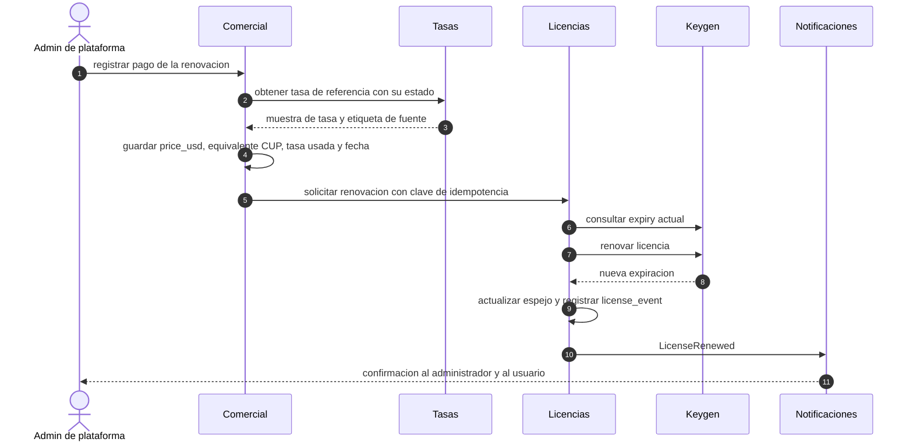

# 8. Flujo de renovación

> Entregable §39‑8 · [Índice](README.md) · Licencias: [doc 7](07-flujo-licencias-keygen.md) · Mandato: la vigencia cuenta **desde la primera activación**; la renovación, **desde la expiración**; estrategia de expiración `REVOKE_ACCESS`.

## 8.1 Reglas

1. **Renovar** = el proveedor suma `duration` de la política a la fecha de expiración según `renewalBasis` ✅ (`FROM_EXPIRY`: `expiry + duration`).
2. La renovación se dispara **solo** con un pago **confirmado** en nuestro sistema (Keygen no factura).
3. Cada renovación genera un registro comercial con `price_usd`, `cup_reference_value`, `exchange_rate_used`, `pricing_date` y la muestra de tasa usada.
4. Las llamadas al proveedor llevan **clave de idempotencia** y se comprueba el `expiry` actual antes y después.
5. Una licencia **revocada** no se renueva (se emite otra). Una licencia **nunca activada** (expiración nula) **no se renueva**: se espera la activación o se emite una nueva (comportamiento del proveedor por verificar en S‑1).

## 8.2 Escenarios con ejemplos

Ejemplo: licencia `IPV-MENSUAL` (30 días) activada el **2026‑10‑01** → vence el **2026‑10‑31**.

| Escenario | Fecha de renovación | `FROM_EXPIRY` (mandato) | `FROM_NOW` | `FROM_NOW_IF_EXPIRED` |
|---|---|---|---|---|
| **Anticipada** (día 20) | 2026‑10‑21 | **2026‑11‑30** (no pierde días) | 2026‑11‑20 (**pierde 10 días**) | 2026‑11‑30 |
| **10 días tarde** | 2026‑11‑10 | 2026‑11‑30 (solo **20 días útiles** de los 30 pagados) | 2026‑12‑10 | 2026‑12‑10 (30 días) |
| **45 días tarde** | 2026‑12‑15 | **2026‑11‑30 → la licencia sigue vencida tras pagar** | 2027‑01‑14 | 2027‑01‑14 |

> ⚠️ **Hallazgo**: con `renewalBasis = FROM_EXPIRY` puro, un cliente que renueva tarde **recibe menos de lo que pagó o ninguna vigencia útil**. `FROM_NOW_IF_EXPIRED` ✅ conserva lo bueno de `FROM_EXPIRY` (suma al renovar antes de tiempo) y evita ese defecto. **El mandato actual es `FROM_EXPIRY`; no se cambia sin que el propietario decida** ([D‑12](16-decisiones-pendientes.md#d-12)). Mitigación si se mantiene `FROM_EXPIRY`: regla propia que, al renovar una licencia ya vencida, aplique **ajuste de fecha** o emita una licencia nueva y registre el motivo.
>
> Nota de contraste ([C‑04](01-analisis-arquitectonico.md#c-04)): el documento de precios de IPV dice lo contrario (*"los días que le quedaban no se suman automáticamente"*).

## 8.3 Flujos

### Renovación por pago (manual, MVP)

Estados de la solicitud: `SOLICITADA → PAGO_CONFIRMADO → APLICADA`, con `FALLIDA` (reintentable, misma clave de idempotencia) y `CANCELADA`. Un trabajo de **conciliación** compara la expiración del proveedor con la nuestra y alerta ante diferencias.

### Recordatorios de vencimiento

Calendario configurable (por defecto 🧭): **T‑14, T‑7, T‑3, T‑1 y día del vencimiento**, por bandeja interna y correo, al usuario y a su administrador. El umbral **POR VENCER** de la app usa el mismo parámetro ([doc 7](07-flujo-licencias-keygen.md#76-estados-de-licencia)).

### Otros movimientos

| Caso | Tratamiento 🧭 |
|---|---|
| **Trial → pago** | Política de pago con `transferStrategy = RESET_EXPIRY` ✅ (confirmar en S‑1) o emitir una licencia nueva y revocar la de prueba; el precio del trial **no** se descuenta salvo decisión comercial ([D‑08](16-decisiones-pendientes.md#d-08)). |
| **Cambio de política** (subir/bajar de plan) | `transfer` del proveedor + registro comercial del ajuste; sin prorrateo automático (⛔ [D‑08](16-decisiones-pendientes.md#d-08)). |
| **Suspensión por impago** | Acción administrativa auditada; reversible (`reinstate`); el servidor bloquea de inmediato. |
| **Reembolso / revocación** | Revocación terminal + anulación del pago/recibo; nunca se borra el historial. |
| **Renovación en lote** | Varias licencias de una organización en un solo contrato con ítems separados. |
| **Renovación automática** | **Fuera de alcance** mientras no exista pasarela de pago ([D‑13](16-decisiones-pendientes.md#d-13)). |

## 8.4 Registro comercial y equivalente en CUP

El **precio primario es USD**. El equivalente en CUP se **calcula dinámicamente** con la tasa vigente al mostrarlo y se **congela** al crear el ítem de contrato o pago:

| Campo | Significado |
|---|---|
| `price_usd` | Precio del catálogo editable |
| `cup_reference_value` | `price_usd × exchange_rate_used` (redondeo a 2 decimales, `HALF_UP`) |
| `exchange_rate_used` | Valor de la tasa usada |
| `pricing_date` | Fecha de la cotización |
| `rate_sample_id` | Muestra de tasa (fuente, estado y hora conservados) |

**Ilustración** con la tasa USD **de prueba** de 755.00 CUP (dato aportado por el usuario, *no* una constante del sistema ni una tasa oficial):

| Política | Días | USD | CUP (USD × 755.00) | USD por cada 30 días |
|---|---|---|---|---|
| `IPV-TRIAL-7D` | 7 | 25 | 18 875.00 | 107.14 |
| `IPV-MENSUAL` | 30 | 75 | 56 625.00 | 75.00 |
| `IPV-TRIMESTRAL` | 90 | 195 | 147 225.00 | 65.00 |
| `IPV-SEMESTRAL` | 180 | 360 | 271 800.00 | 60.00 |
| `IPV-ANUAL` | 365 | 600 | 453 000.00 | 49.32 |
| `IPV-BIENAL` | 730 | 1 020 | 770 100.00 | 41.92 |
| Desarrollo (pago único) | — | 2 800 | 2 114 000.00 | — |

Tabla de descuento frente al precio diario mensual: trial **+42.9 %** (prueba de pago), 90 d **−13.3 %**, 180 d **−20.0 %**, 365 d **−34.2 %**, 730 d **−44.1 %**.

Toda cifra en CUP se muestra con **"Tasa de referencia de elTOQUE"**, su fecha y hora, y **"Tasa de referencia, no oficial"** ([doc 10](10-flujo-eltoque-cache.md#106-etiquetas-obligatorias)). Si la fuente es una tasa manual o de prueba, se etiqueta como tal.

## 8.5 Casos límite

| Caso | Tratamiento |
|---|---|
| Dispositivo **sin conexión** cuando se renueva | Su archivo sigue mostrando la expiración antigua hasta refrescarse; si esa fecha pasa antes de reconectar, verá VENCIDA. Mitigación: aviso previo, refresco forzado al sincronizar y TTL adecuado ([T‑05](15-trade-offs.md#t-05)). |
| Cambio de precio entre cotización y pago | Se respeta el precio y la tasa **congelados en el contrato**; vigencia de la cotización ⛔ ([D‑13](16-decisiones-pendientes.md#d-13)). |
| Falla de la conciliación | Alerta y reintento; nunca se aplica una renovación sin pago confirmado. |
| Doble clic / reintento | Clave de idempotencia: un solo efecto. |
| Suscripciones por usuario vs por organización | Cada licencia es por usuario; el contrato puede agrupar varias ([D‑09](16-decisiones-pendientes.md#d-09)). |
