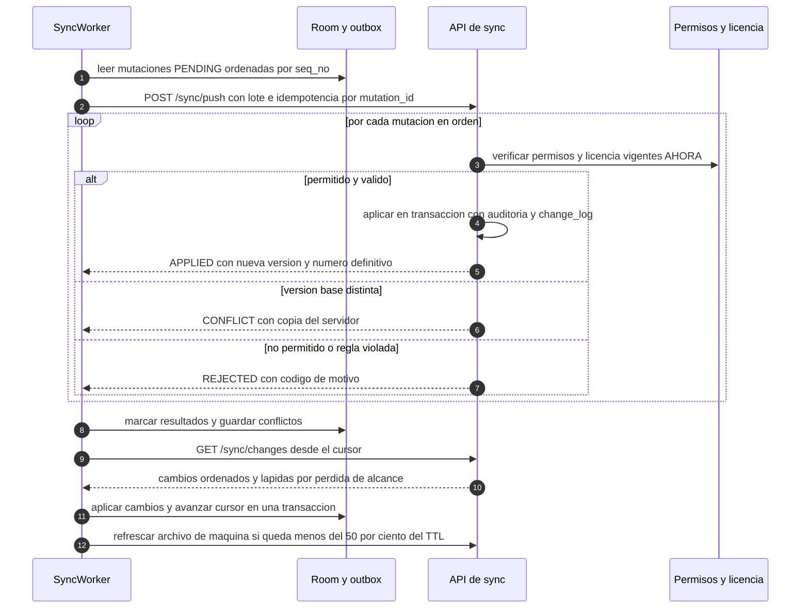

# 9. Flujo Android: offline → sincronización

> Entregable §39‑9 · [Índice](README.md) · Marco: [ADR‑0001](adr/0001-reabrir-offline-y-multisucursal.md) (gates G‑1…G‑3, etapas 6a‑6c) · Datos: [doc 3](03-modelo-er.md#36-qué-se-replica-a-android). 🧭 = propuesta.

## 9.1 Objetivos y límites

- La app es **útil sin red** para lo que el negocio hace en campo: consultar fichas vigentes y valores, **registrar controles IPV, movimientos y conteos**, y ver la última tasa conocida.
- **El servidor es la autoridad**: el dispositivo propone cambios; el servidor valida permisos, licencia y reglas al procesarlos.
- **Nunca se pierde una edición en silencio**: ante duda, hay conflicto visible o rechazo con motivo, y el dato queda en el dispositivo.
- **Límites deliberados**: los cambios de estado de una ficha, la edición de catálogo y de valores IPV, y todo lo administrativo son **solo en línea** (ADR‑0001, [§5](adr/0001-reabrir-offline-y-multisucursal.md#5-despliegue-escalonado)).
- Conectividad cubana: pocos bytes, reintentos pacientes, **solo Wi‑Fi por defecto** para descargas grandes ([§9.6](#96-workmanager-y-consumo-de-datos)).

## 9.2 Arquitectura local

```text
 UI (Compose) ──► ViewModel ──► Caso de uso ──► Repositorio ──► Room + SQLCipher
                                     │                              ▲   (única fuente de verdad de la UI)
                                     │ en UNA transacción:           │
                                     ├─ aplicar el cambio local ─────┤
                                     └─ encolar mutación en OUTBOX ──┘
 WorkManager ─► SyncWorker ─► (1) push de la outbox  (2) pull de cambios  (3) refrescar archivo de licencia
```

| Tabla local | Contenido |
|---|---|
| Tablas de entidad (réplica) | Columnas estándar + **`sync_state`** (`SYNCED`, `PENDING`, `CONFLICT`, `REJECTED`) + **`last_synced_at`** |
| `outbox` | `mutation_id` (UUID), `seq_no` monótono del dispositivo, `entity_type`, `entity_id`, `op`, `base_version`, `payload`, `client_time`, `attempts`, `last_error`, `state` |
| `sync_state` | `cursor`, `server_epoch`, `last_pull_at`, `last_push_at`, `bootstrap_done`, `schema_version` |
| `conflicts` | Copia local y copia del servidor para el centro de conflictos |
| `rates_cache` | Última tasa conocida por instrumento, con su estado y hora de lectura |
| Archivo de licencia | Certificado de máquina guardado con protección de Keystore |

**Cifrado local**: Room sobre **SQLCipher**; la clave de la BD es aleatoria (256 bits) y se guarda **envuelta** por una clave AES‑GCM no exportable del Android Keystore (con autenticación del usuario opcional para el bloqueo de la app). `allowBackup=false`. No se usa `EncryptedSharedPreferences` (obsoleta ✅, [H‑07](01-analisis-arquitectonico.md#12-hallazgos-que-más-condicionan-el-diseño)).

**IDs**: el dispositivo genera **UUID v7** al crear; así las entidades creadas offline ya tienen su identidad definitiva. Solo los **números de documento** (`IPV‑AAAA‑NNNN`) los asigna el servidor.

## 9.3 Qué funciona sin conexión

| Operación | Offline | Etapa |
|---|---|---|
| Ver catálogo, fichas vigentes, valores IPV, última tasa | Sí (lectura) | 5 |
| Desbloquear la app con biometría/PIN y licencia vigente | Sí | 5‑7 |
| Registrar **conteos de inventario** | Sí | 6a |
| Registrar **movimientos** y **líneas de Control IPV** | Sí | 6b |
| Editar **borradores** de ficha | Sí | 6c |
| Enviar/validar/aprobar/activar/anular fichas | **No** (solo en línea) | — |
| Editar catálogo, valores IPV, usuarios, roles, licencias | **No** | — |
| Eliminar registros ya sincronizados | **No** (hasta validar el modelo) | — |
| Exportar | Según `DATA_EXPORT` y [D‑28](16-decisiones-pendientes.md#d-28) | — |

La lista definitiva de operaciones offline es ⛔ [D‑28](16-decisiones-pendientes.md#d-28).

## 9.4 Política de conflictos por entidad

Regla general: **versión base + `If‑Match`**. Si la `base_version` de la mutación no coincide con la del servidor y el tipo no es de solo anexado, el resultado es `CONFLICT` con **ambas copias**; nunca "gana la última" sin aviso.

| Entidad | Naturaleza | Política | En caso de conflicto |
|---|---|---|---|
| Movimientos de inventario | **Libro mayor de solo anexado** | Sin fusión: se añaden por `mutation_id` (idempotente). Un saldo negativo **no se rechaza** (el hecho físico ya ocurrió): se marca para revisión. | No hay conflicto; posibles duplicados evitados por `mutation_id`. |
| Conteos | Solo anexado | Se conservan **todos**; el revisor concilia. | Dos conteos del mismo ítem/fecha → ambos visibles. |
| Líneas de Control IPV | Anexado por línea; edición solo del autor | Se aceptan si la versión de ficha es **válida para el período y no está anulada** al procesar. | `REJECTED: FICHA_ANULADA` / `VERSION_NO_VIGENTE_PARA_PERIODO`; si dos dispositivos editan la misma línea → `CONFLICT` con elección *mía / servidor / por campo*. |
| Cabecera de Control IPV | Un solo autor | Número definitivo lo asigna el servidor. | Período duplicado para la misma sucursal → `CONFLICT` (unir o descartar). |
| Borrador de ficha *(etapa 6c)* | Documento | Concurrencia optimista con `base_version`; **un solo borrador abierto** por ficha. | Diferencias por cabecera y por línea; el usuario elige o **duplica como borrador nuevo**; **sin fusión automática de costos**. |
| Transiciones de estado de ficha | Comando con efecto legal | **Solo en línea**; no se encola. | — |
| Catálogo, valores IPV, usuarios, roles, licencias, tasas | Administrativo/fuente externa | **Solo en línea**; el dispositivo solo lee. | — |

**Orden**: dentro de un dispositivo, por `seq_no`; entre dispositivos, por orden de llegada al servidor. `client_time` es **informativo** (el reloj del dispositivo no es confiable).

**Dependencias**: si una mutación depende de otra rechazada (p. ej. línea de un control cuyo encabezado se rechazó), pasa a `REJECTED: DEPENDENCY_FAILED`.

## 9.5 Protocolo de sincronización



1. **Bootstrap** (`GET /sync/bootstrap`): instantánea paginada por entidad, reanudable, comprimida, con `cursor` y `server_epoch`. Solo el alcance y los permisos del usuario; los costos solo con `costs:view`.
2. **Push antes que pull**, para reducir conflictos. El push es **idempotente**: si el `mutation_id` ya existe, el servidor devuelve el **resultado almacenado** sin reaplicar.
3. **Pull por cursor** (`seq` monótono del servidor, **no** marcas de tiempo del cliente). Las bajas y las **pérdidas de alcance** llegan como **lápidas**.
4. **`RESYNC_REQUIRED`** (cursor demasiado antiguo o `server_epoch` distinto, p. ej. tras **restaurar una copia**): se vuelve a hacer bootstrap **conservando la outbox**; las mutaciones pendientes se reintentan sobre el nuevo estado (escenario E‑5).
5. **Versión del cliente**: cabecera de esquema; un cliente demasiado antiguo recibe `426 UPGRADE_REQUIRED`.
6. **Reintentos**: *backoff* exponencial; tope por mutación (p. ej. 8); luego `STUCK` visible para acción del usuario ([§9.8](#98-experiencia-de-usuario)).

## 9.6 WorkManager y consumo de datos

| Aspecto | Propuesta 🧭 (valores ⛔ [D‑28](16-decisiones-pendientes.md#d-28)) |
|---|---|
| Trabajo periódico | `SyncWorker` único y periódico (intervalo configurable, mínimo 15 min de WorkManager), con holgura (*flex*). |
| Disparadores | Tras una escritura local (debounce), al volver a primer plano con red, al abrir sesión, y botón **Sincronizar ahora** (trabajo acelerado). |
| Restricciones | Red conectada; **solo Wi‑Fi** por defecto para *bootstrap* y descargas grandes; el *push* pequeño puede usar datos móviles según preferencia; batería no baja. |
| Ahorro de datos | `gzip`, solo deltas, cargas por campo, sin imágenes salvo necesidad, un solo sondeo por ciclo (nada de consultar la versión cada pocos segundos, como hace hoy `inventario`). |
| Transparencia | Contador de bytes por sincronización y modo "ahorro de datos" en Ajustes. |

## 9.7 Licencia, permisos y seguridad sin conexión

- **Licencia**: se evalúa **cada vez** que la app abre o vuelve a primer plano ([doc 7](07-flujo-licencias-keygen.md#76-estados-de-licencia)). Con **OFFLINE EN GRACIA** se opera con aviso de días restantes; con **SIN CONEXIÓN/VENCIDA/SUSPENDIDA/REVOCADA** se bloquea según la tabla de estados.
- **Permiso revocado o licencia vencida con el dispositivo offline** (escenario E‑3): al reconectar, el servidor **rechaza** las mutaciones (`SCOPE_REVOKED` / `LICENSE_*`), no las considera válidas, y envía lápidas; el cliente retira los datos fuera de alcance. Los **datos pendientes se conservan cifrados** hasta decidir (exportar/descartar) según [D‑28](16-decisiones-pendientes.md#d-28).
- **Cierre de sesión / revocación terminal**: borrado de BD y claves locales (política ⛔).
- **Bloqueo de la app**: biometría `BIOMETRIC_STRONG` o PIN tras inactividad; la clave de la BD se libera con `CryptoObject` cuando se activa esa opción.
- **Red**: HTTPS obligatorio; en *release* solo CA del sistema y **pines con respaldo y caducidad** (Network Security Config); sin CA de usuario salvo variante *debug/enterprise* ([C‑10](01-analisis-arquitectonico.md#c-10)).
- **Minimización**: se sincroniza solo lo necesario; los costos solo con `costs:view`.

## 9.8 Experiencia de usuario

- **Banda permanente**: "Datos al `<fecha y hora>` · *N* cambios pendientes" (requisito 4 del ADR).
- Cada registro muestra su estado (`SYNCED`, `PENDING`, `CONFLICT`, `REJECTED`).
- **Centro de conflictos y rechazos** con motivo en lenguaje claro y acciones (*conservar la mía*, *usar la del servidor*, *duplicar*, *descartar*, *reintentar*).
- La tasa de referencia muestra siempre su fuente, hora y estado (*"Última actualización disponible"* si es antigua).

## 9.9 Pruebas

| Nivel | Qué se prueba |
|---|---|
| Unidad | Outbox, orden, reintentos, fusión por campo, evaluador de licencia (archivos dorados), reloj. |
| Room | Migraciones con esquemas exportados; integridad del cifrado. |
| WorkManager | `TestDriver`: restricciones, *backoff*, trabajo único. |
| **Integración contra el servidor real** (Testcontainers) | **E‑1…E‑5** del ADR: desconexión, concurrencia, permiso revocado, reintentos idempotentes, restauración. |
| Caos | Corte de red a mitad de *push*, proceso matado en medio de una transacción, respuestas duplicadas/desordenadas. |
| Rendimiento | *Bootstrap* con decenas de miles de filas; consumo de datos por ciclo. |
| Seguridad | Reloj retrocedido, archivo copiado a otro dispositivo, APK con firma distinta (comportamiento blando). |

## 9.10 Trazabilidad con el ADR

Supuestos 1‑6 del documento previo → [ADR‑0001 §4](adr/0001-reabrir-offline-y-multisucursal.md#4-los-seis-supuestos-previos-como-requisitos). Criterio de salida: E‑1…E‑5 en verde en CI antes de que ningún cliente real escriba offline.
