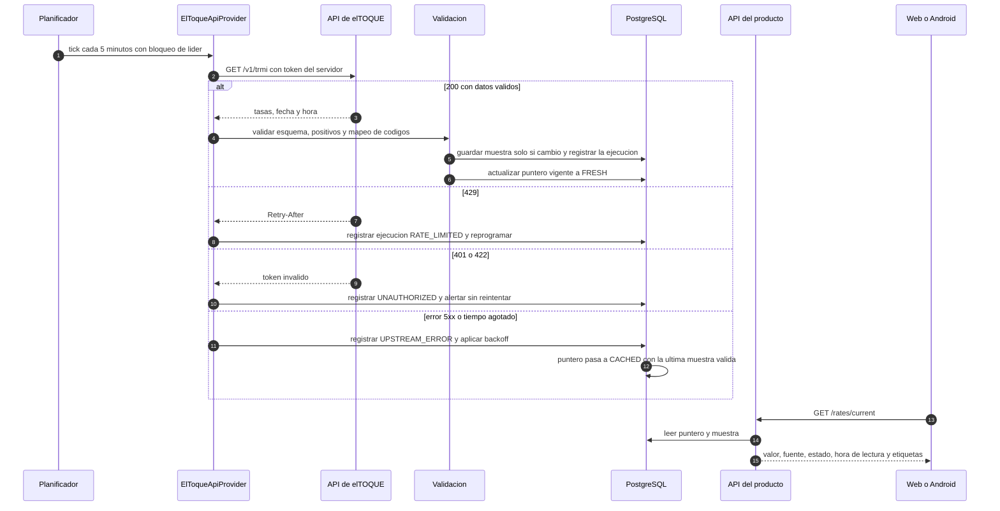

# 10. Flujo Backend → API de elTOQUE → caché → Web/Android

> Entregable §39‑10 · [Índice](README.md) · Estrategia operativa (frecuencia, reintentos, alertas, pruebas): [doc 13](13-estrategia-actualizacion-tasas.md) · Fuentes: [anexo B](anexos/B-fuentes-y-verificaciones.md#b1-eltoque-api-de-tasas).

## 10.1 Reglas no negociables

1. **Solo la API oficial** (`GET /v1/trmi`, token por aplicación) y **solo desde el backend**.
2. **Nunca** raspar HTML, evadir Cloudflare/*Managed Challenge*, resolver CAPTCHA, usar *proxies*, rotar identidades ni automatizar masivamente el sitio. Si aparece un desafío, **no se derrota**.
3. La clave vive **solo** en la variable/secreto `ELTOQUE_API_KEY`: nunca en Android, JS, GitHub, código ni registros.
4. Web y Android consultan **únicamente nuestro backend**.
5. Se **cachea y se conserva historial**. Refresco por defecto: **5 minutos**, configurable.
6. Se etiqueta siempre como **"Tasa de referencia de elTOQUE"**, con fecha y hora, y **"Tasa de referencia, no oficial"** (jamás "tasa oficial de Cuba").
7. Sin conexión con la fuente: **último valor válido** marcado `FUENTE: elTOQUE · ESTADO: DATOS EN CACHÉ`. **Nunca** inventar, interpolar ni cambiar la fuente en silencio.
8. Los valores de prueba (30/09/2026 12:57) son **semilla**, no constantes ([doc 13](13-estrategia-actualizacion-tasas.md#1311-semillas-y-datos-de-prueba)).

## 10.2 Componentes y puertos

```text
               ┌────────────────────────── módulo `rates` ──────────────────────────┐
 Planificador ─►  ExchangeRateProvider  (puerto)                                      │
 (cada 5 min)  │    ├─ ElToqueApiProvider   → HTTPS a tasas.eltoque.com (token)       │
               │    ├─ CachedProvider       → decorador: ante fallo sirve la última   │
               │    │                         muestra válida con estado CACHED         │
               │    ├─ ManualRateProvider   → tasa ingresada con motivo y aprobación   │
               │    └─ SeedProvider         → SOLO dev/test (el perfil de producción  │
               │                              se niega a arrancar con él)             │
               │  Validación estricta → muestras inmutables → puntero "vigente"        │
               │  → instantáneas (fichas, contratos) → API para clientes               │
               └────────────────────────────────────────────────────────────────────────┘
```

| Proveedor | Estado | Notas |
|---|---|---|
| `ElToqueApiProvider` | Se construye (Fase 8) | Respeta límites y `Retry-After`; mapea códigos del proveedor a instrumentos. |
| `CachedProvider` | Se construye | Decorador; **no** altera valores. |
| `ManualRateProvider` | Se construye (Fase 3, para poder completar fichas antes de tener token) | Etiquetado `MANUAL`, nunca "elTOQUE". |
| `SeedProvider` | Solo dev/test | Etiquetado `TEST`/`SEED_TEST`. |
| ~~`ElToqueHtmlScraperProvider`~~ | **No se implementa** (recomendación) | Los términos prohíben *"robots, arañas, aplicaciones de scrapping"* ✅; el prompt lo admite "a lo sumo experimental y deshabilitado": se recomienda **no construirlo** (⛔ [D‑32](16-decisiones-pendientes.md#d-32)). |

## 10.3 Contrato con elTOQUE: lo verificado y lo que no

| Aspecto | Estado |
|---|---|
| Endpoint `GET https://tasas.eltoque.com/v1/trmi` | ✅ |
| Autenticación `Authorization: Bearer <token>`; un token por aplicación | ✅ |
| Parámetros opcionales `date_from`, `date_to` (formato `AAAA‑MM‑DD HH:MM:SS`, intervalo < 24 h) | ✅ |
| Límites por clave: 60/min y 10/s por defecto; 429 con `Retry-After`; cabeceras `X-RateLimit-*` | ✅ |
| Esquema de la respuesta 200 | **No documentado oficialmente.** Muestra comunitaria (2025‑10‑04): `tasas{USD, ECU, MLC, USDT_TRC20, BTC, BNB, TRX}`, `date`, `hour`, `minutes`, `seconds` |
| Zona horaria de `date/hour/minutes/seconds` | ⛔ **No documentada** (spike S‑2) |
| Código del euro | `ECU` en la muestra comunitaria → mapear a `EUR` en `rate_provider_mappings` |
| **CAD, MXN, ZELLE, CLA** | ⛔ El sitio de elTOQUE los muestra, pero **no consta** que la API los devuelva (la muestra y la FAQ no los incluyen) |

**Consecuencias de diseño**

- El analizador es **estricto pero tolerante a campos nuevos**: exige `tasas` y valores numéricos positivos; ignora claves desconocidas **registrándolas** (alerta de *drift* de contrato).
- Un instrumento **no entregado por la API se muestra como "No disponible vía API"**; **nunca** se rellena en silencio con otra fuente. Si la empresa necesita CAD/MXN/ZELLE/CLA y la API no los da, solo existen como **tasa manual** etiquetada así.
- `source_ts_utc` queda **nulo** hasta confirmar la zona horaria; mientras tanto la **vejez se mide con `fetched_at`** (hora de nuestro servidor, UTC), que es la autoritativa.
- La variación (sube/baja) **no la entrega la API**: se calcula con **nuestro** historial y se etiqueta "respecto a la muestra anterior almacenada".

## 10.4 Flujo



## 10.5 Estados de la tasa

| Estado | Cuándo | Texto en la interfaz |
|---|---|---|
| `FRESH` | Última ejecución correcta y edad ≤ ventana de frescura (por defecto **2 × intervalo = 10 min**) | "Tasa de referencia de elTOQUE · `<fecha y hora>`" |
| `STALE` | La edad supera la ventana pero el proveedor responde (la fuente no cambió o llega tarde) | "**Última actualización disponible**: `<fecha y hora>`" |
| `CACHED` | El proveedor falla (error, 429 sostenido, caído) y se sirve la última muestra válida | "**FUENTE: elTOQUE · ESTADO: DATOS EN CACHÉ** — Última actualización disponible: `<fecha y hora>`" |
| `UNAVAILABLE` | Nunca hubo una muestra válida | "Tasa no disponible" (no se muestra ninguna cifra) |
| `MANUAL` | Valor ingresado por la empresa con motivo | "Tasa manual (no es de elTOQUE) · ingresada por `<usuario>` · motivo" |
| `TEST` | Semilla de pruebas (solo dev/test) | "**DATOS DE PRUEBA**" |

Además: `is_stale` (booleano por edad) y `anomaly` (salto brusco respecto a la muestra anterior; se **avisa** pero no se descarta, porque el mercado sí puede moverse con fuerza).

## 10.6 Etiquetas obligatorias

| Dónde | Texto exacto |
|---|---|
| Junto a cada tasa | **Tasa de referencia de elTOQUE** + fecha y hora de la lectura |
| Siempre visible cerca de la tasa | **Tasa de referencia, no oficial** |
| Fuente (obligación contractual ✅) | **Fuente: elTOQUE** |
| Datos antiguos | **Última actualización disponible** + fecha y hora |
| API caída | **FUENTE: elTOQUE · ESTADO: DATOS EN CACHÉ** |
| Prohibido | "Tasa oficial de Cuba", "tasa oficial", o dar a entender patrocinio de elTOQUE |

Aplica a: panel web, sitio público (precios en CUP), app Android, PDF/Excel exportados, fichas y contratos que muestren la tasa.

## 10.7 API hacia los clientes

`GET /api/v1/rates/current` (ejemplo con **datos de prueba**; los decimales viajan como cadenas):

```json
{
  "data": [
    {
      "instrument": "USD",
      "base": "CUP",
      "value": "755.000000",
      "label": "Tasa de referencia de elTOQUE",
      "disclaimer": "Tasa de referencia, no oficial",
      "source": "SEED_TEST",
      "status": "TEST",
      "is_test": true,
      "source_timestamp": null,
      "fetched_at": "2026-09-30T16:57:00Z",
      "age_seconds": 0,
      "variation": null
    }
  ]
}
```

Otros: `GET /rates/history?instrument=&from=&to=` (paginado) · `GET /rates/status` (salud del proveedor, última ejecución correcta, cuota restante, para administradores) · `POST /rates/manual` (permiso `rates:manual`, motivo obligatorio) · `GET /rate-snapshots/{id}`.

## 10.8 Web y Android

- **Web**: lee de `/rates/current` (con caché corta del navegador); muestra siempre las etiquetas de §10.6; nunca calcula contra una cifra sin su estado.
- **Android**: guarda la **última tasa conocida con su estado y hora de lectura**; sin red la muestra como **"Última actualización disponible"** con su antigüedad; las conversiones offline usan esa tasa **etiquetada**, y los documentos que requieran una instantánea se generan en el servidor (no se "inventa" una tasa en el dispositivo).

## 10.9 Cumplimiento de los términos de elTOQUE

| Obligación / prohibición | Cómo se cumple |
|---|---|
| Citar a elTOQUE como fuente | Etiquetas de §10.6 en toda superficie |
| Valores referenciales | "Tasa de referencia, no oficial" |
| No dar la clave a terceros; una clave por aplicación | Clave solo en el servidor; **un único despliegue central** usa la clave; las instalaciones por cliente necesitarían la suya ([doc 2](02-diagrama-arquitectura.md#23-topología-de-despliegue-inicial)) |
| No cambiar los datos | Se guarda el valor tal cual; **no se aplican márgenes ni redondeos al valor de elTOQUE**; una tasa "interna" es otra fuente (`MANUAL`) con otra etiqueta |
| No raspar ni extraer masivamente | Solo la API, sin *backfill* masivo |
| Usar el contenido solo para que los usuarios lo vean en la aplicación | ⛔ **Zona gris**: guardar la tasa como instantánea dentro de fichas/contratos y exportarla en PDF/Excel — pedir confirmación escrita a elTOQUE ([D‑04](16-decisiones-pendientes.md#d-04)) |
| No sublicenciar ni revender los datos | La tasa se muestra a usuarios licenciados del producto; **no** se expone una API pública de tasas |
| No insinuar patrocinio | Solo texto de atribución; sin logotipos |
| Cambios futuros (tarifas, términos) | Vigilancia manual del documento y correo de contacto del registro; el proveedor es intercambiable |

## 10.10 Interacción con fichas, contratos y precios

- La **instantánea** (`rate_snapshots`) se toma al **enviar una ficha a revisión** y al **crear un ítem de contrato o pago**; conserva valor, fuente, estado y hora de cada instrumento.
- **Qué tasa vale en un documento oficial** es una **política por empresa** (`rate_policies`), no una constante ([D‑03](16-decisiones-pendientes.md#d-03)): la tasa de referencia de elTOQUE **no se asume oficial**.
- El equivalente en CUP de los precios de licencia se calcula con la tasa del instrumento USD y se congela al contratar ([doc 8](08-flujo-renovacion.md#84-registro-comercial-y-equivalente-en-cup)).
